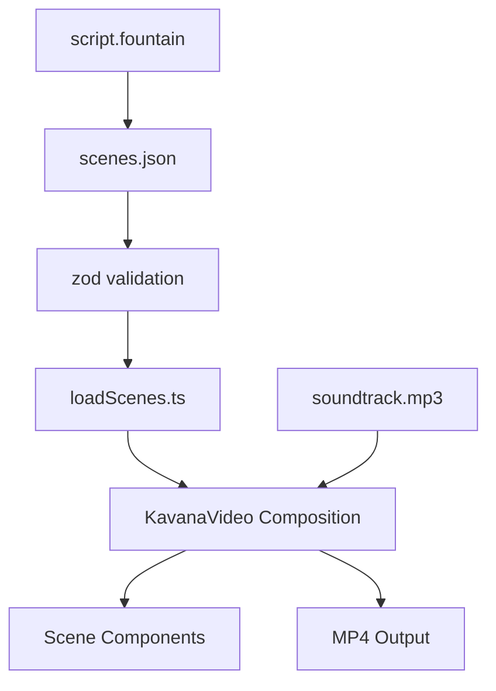

# PLAN — Kavana Vibe Coding Ex06

**Group code:** `biu-int3`

---

## High-Level Workflow

```
Idea → Business Brief → AI Prompts → scenes.json → Fountain Script
  → Remotion Code → Suno Soundtrack → Studio Preview → MP4 Render
  → Documentation → GitHub Submission
```

This follows the assignment's pedagogical requirement: **planning and structured data before tooling**.

---

## Main Project Phases

| Phase | Deliverables | Status |
|-------|-------------|--------|
| 1. Planning | PRD, PLAN, TODO, brief prompt | Done |
| 2. Content | script.fountain, scenes.json, content prompts | In progress |
| 3. Infrastructure | Node, Remotion scaffold, dependencies | Pending |
| 4. Implementation | schema, components, composition, audio | Pending |
| 5. QA | Studio preview, 8-point test checklist | Pending |
| 6. Render | final-video.mp4 | Pending |
| 7. Documentation | README, screenshots, prompt logs, cost estimate | Pending |
| 8. Submission | GitHub push, PDF for Moodle | Pending |

---

## Chosen Tools and Reasoning

| Tool | Purpose | Why |
|------|---------|-----|
| **Remotion v4** | Programmatic video | Course requirement; React-based; MP4 render built-in |
| **TypeScript** | Type safety | Matches Remotion defaults; pairs with zod |
| **zod** | JSON validation | Prompt-injection defense; schema enforcement |
| **@remotion/google-fonts** | Typography | Crisp EN/HE text without bundling font files |
| **Suno** | Soundtrack | Course-recommended; documented prompt |
| **Cursor + Claude** | Vibe Coding agent | Code, docs, and prompt generation |
| **Git + GitHub** | Version control & submission | Assignment requirement |

---

## Expected Repository Structure

```
biu-int3-ex06/
├── README.md
├── PRD.md  PLAN.md  TODO.md
├── prompts/          # Documented AI prompts (01–08)
├── data/scenes.json  # Scene schema (single source of truth)
├── script/script.fountain
├── music/            # Suno prompt + soundtrack.mp3
├── screenshots/      # Execution proof
├── output/final-video.mp4
├── src/
│   ├── Root.tsx
│   ├── Composition.tsx
│   ├── schema.ts
│   ├── loadScenes.ts
│   ├── components/
│   ├── scenes/
│   └── styles/
├── package.json
└── remotion.config.ts
```

---

## Data / Script / Media Pipeline



1. Human writes Fountain script (creative blueprint).
2. AI assists conversion to structured JSON.
3. zod validates JSON at import time — rejects malformed or oversized strings.
4. Composition maps each scene `id` to a React scene component.
5. Suno soundtrack loaded via `<Audio>`; duration matched to `meta.totalDurationInFrames`.

---

## AI-Agent Workflow

1. **Human defines intent** — product concept, scene arc, visual style, constraints.
2. **Agent generates artifacts** — PRD drafts, JSON, Remotion components, docs.
3. **Human reviews and edits** — accept/reject/iterate; documented in `prompts/`.
4. **Agent implements code** — driven by JSON schema + vibe prompt (`prompts/05-remotion-generation.md`).
5. **Human verifies** — Studio preview, render, screenshot capture.

---

## Prompting Workflow

Each prompt file in `prompts/` records:

- Prompt text (verbatim)
- AI tool/model used
- Intended output
- Outcome: accepted / edited / rejected
- Iteration notes

Prompt sequence: idea → brief → script → JSON → Remotion code → music → debugging → refinement.

---

## Testing and Verification Plan

| # | Test | Method |
|---|------|--------|
| 1 | Dependencies install | `npm install` exit 0 |
| 2 | Preview runs | `npm run studio` loads composition |
| 3 | MP4 renders | `npm run render` produces output |
| 4 | All 6 scenes appear | Visual inspection in Studio |
| 5 | Text readable | Check EN + HE overlays at 1080p |
| 6 | Audio present | Verify soundtrack plays in preview/render |
| 7 | Assets load | No missing-font or 404 errors |
| 8 | No runtime errors | Clean console in Studio |

Screenshots captured for items 2, 3, and final output.

---

## Rendering Plan

```bash
npm run render
# Equivalent: npx remotion render src/index.ts KavanaVideo output/final-video.mp4
```

- **Codec:** H.264
- **Resolution:** 1920×1080
- **FPS:** 30
- **Duration:** 1800 frames (~60s)
- Output committed to `output/final-video.mp4`

---

## Documentation Plan

- **README.md** — Full assignment report (all required sections).
- **PRD.md / PLAN.md / TODO.md** — Planning trilogy (this file + siblings).
- **prompts/** — Complete prompt audit trail.
- **music/music-prompt.md** — Suno generation documentation.
- Screenshots embedded in README with captions explaining what each proves.

---

## Risk Analysis and Mitigations

| Risk | Impact | Mitigation |
|------|--------|------------|
| Node not installed | Blocks all work | Install Node LTS at phase 3 start |
| Suno track missing | No audio in final video | Generate placeholder tone; document fallback |
| Render timeout | Miss deadline | Reduce complexity; test early render |
| Hebrew font rendering | Illegible text | Use `@remotion/google-fonts` Heebo; test in Studio |
| JSON schema drift | Runtime crashes | zod validation + TypeScript types |
| Repo not accessible | Non-submission | Public repo; verify lecturer access |
| Large MP4 in git | Push failures | Git LFS or reasonable file size (~10MB target) |

---

## Estimated Timeline

| Day | Tasks |
|-----|-------|
| Day 1 (Jun 23) | Planning docs, script, JSON, Remotion scaffold, core scenes |
| Day 2 (Jun 24) | Audio, QA, render, README, screenshots, GitHub push, PDF |

**Deadline:** 24/06/2026 (Cinderella time)
