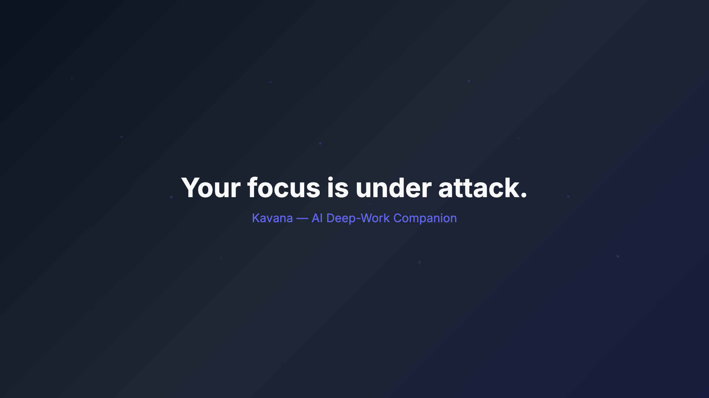
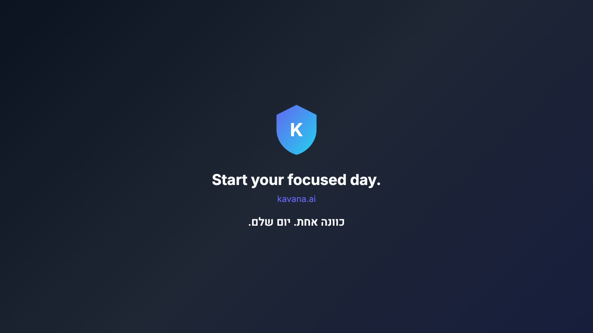

# Kavana — AI Deep-Work Companion

**Assignment:** AI Course — Exercise 06 (Vibe Coding / Remotion)  
**Group code:** `biu-int3`  
**Repository:** [biu-int3-ex06](https://github.com/itayleshem/biu-int3-ex06)

---

## Group Members

| Name | Role |
|------|------|
| *[Member 1 — fill in]* | Vibe Coding lead |
| *[Member 2 — fill in if applicable]* | — |
| *[Member 3 — fill in if applicable]* | — |

> **Note:** Replace placeholder names before Moodle PDF submission.

---

## Project Description

**Kavana** (כוונה — "intention/focus") is a fictional AI deep-work companion presented through a ~60-second programmatic marketing video. The project demonstrates the full Vibe Coding production pipeline: from business brief and structured JSON through AI-assisted code generation to a rendered MP4.

---

## Goal of the Final Video

Create a polished, coherent 60-second explainer that:

1. Hooks the viewer with a focus/distraction problem
2. Introduces Kavana as the AI solution
3. Showcases three product features
4. Provides proof via animated statistics
5. Closes with a bilingual call to action

**Output:** [`output/final-video.mp4`](output/final-video.mp4) — 1920×1080, 30fps, ~60 seconds.

---

## Target Audience

- Knowledge workers aged 22–35 struggling with digital distraction
- University course evaluators reviewing the Vibe Coding assignment
- Viewers interested in AI-assisted productivity concepts

---

## Vibe Coding Workflow Used

This project follows the assignment's prescribed human→AI collaboration model:

```
Idea → Business Brief → AI Prompts → scenes.json → Fountain Script
  → Remotion Code → Soundtrack → Studio Preview → MP4 Render → Documentation
```

| Stage | Human Role | AI Agent Role |
|-------|-----------|---------------|
| Planning | Define product concept, constraints, evaluation criteria | Draft PRD, PLAN, brief |
| Content | Review script tone, approve scene arc | Generate Fountain script + JSON |
| Code | Review architecture, security, polish | Generate Remotion components |
| Audio | Approve mood/instrument choices | Provide Suno prompt (user generates track) |
| QA | Verify preview, approve render | Debug fixes documented in prompts/ |
| Docs | Final review, self-assessment | Generate README structure, compliance matrix |

**Key principle:** Planning and structured data (`scenes.json`) were written **before** installing Remotion — demonstrating that intent precedes tooling.

See also: [PRD.md](PRD.md) | [PLAN.md](PLAN.md) | [TODO.md](TODO.md) | [prompts/](prompts/)

---

## Tools and Technologies

| Tool | Version / Notes | Purpose |
|------|----------------|---------|
| **Remotion** | v4.0.286 | Programmatic video framework |
| **React** | 18.3 | UI components for scenes |
| **TypeScript** | 5.8 | Type-safe codebase |
| **zod** | 4.3.6 | JSON schema validation |
| **@remotion/google-fonts** | 4.0.286 | Inter (EN) + Heebo (HE) typography |
| **Node.js** | v24 LTS | Runtime |
| **Cursor + Claude** | Agent mode | Vibe Coding development partner |
| **Suno** (optional) | External | Soundtrack generation — see `music/music-prompt.md` |
| **Git + GitHub** | — | Version control and submission |

---

## AI Models / Tools Used

| Model / Tool | Used For | Iterations (est.) |
|-------------|----------|-------------------|
| Claude (Cursor Agent) | PRD, PLAN, script, JSON, Remotion code, docs, debugging | ~15–20 prompts |
| Suno AI | Soundtrack (prompt provided; placeholder WAV used for render) | 1 prompt |
| Remotion Studio | Preview and QA | Manual |

---

## Prompting Process Summary

All prompts are documented in [`prompts/`](prompts/) with:

- Verbatim prompt text
- AI tool/model used
- Intended output
- Outcome (accepted / edited / rejected)
- Iteration notes

| # | File | Purpose |
|---|------|---------|
| 00 | [00-idea.md](prompts/00-idea.md) | Project idea selection |
| 01 | [01-brief.md](prompts/01-brief.md) | Business brief |
| 02 | [02-script.md](prompts/02-script.md) | Fountain script |
| 03 | [03-json-structure.md](prompts/03-json-structure.md) | JSON scene structure |
| 04 | [04-remotion-generation.md](prompts/04-remotion-generation.md) | Main Remotion vibe prompt |
| 05 | [05-music-generation.md](prompts/05-music-generation.md) | Suno music prompt |
| 06 | [06-debugging.md](prompts/06-debugging.md) | Debug iterations |
| 07 | [07-refinement.md](prompts/07-refinement.md) | Final polish |

---

## How Structured JSON Is Used

[`data/scenes.json`](data/scenes.json) is the **single source of truth** bridging human concept and code:

- **6 scenes** with id, title, on-screen text, voiceover, visual description, duration, animation/transition types, palette, audio cues
- **Top-level meta:** brand, tagline, Hebrew tagline, fps, dimensions, total duration
- **Validated at load time** by zod schema in [`src/schema.ts`](src/schema.ts)
- **Mapped to components** via `componentType` field → React scene components in [`src/scenes/`](src/scenes/)

The composition ([`src/Composition.tsx`](src/Composition.tsx)) reads validated JSON and renders each scene as a timed `<Sequence>`.

---

## How the Script / Story Structure Is Used

[`script/script.fountain`](script/script.fountain) serves as the creative blueprint (Show, Don't Tell):

| Scene | Script Beat | Visual Action |
|-------|------------|---------------|
| 1 Hook | "Your focus is under attack" | Particles drift; title scales in |
| 2 Problem | Notification cascade | Cards slam in; focus meter drains to 12% |
| 3 Solution | Kavana shield activates | Shield expands; meter recovers |
| 4 Features | Three pillars | Feature cards slide in sequentially |
| 5 Proof | +176% deep work | Before/after split with animated counter |
| 6 CTA | Bilingual tagline | Logo pulse + Hebrew RTL text |

The Fountain script was converted to JSON (not the reverse), preserving the assignment's planning-first workflow.

---

## Installation

```bash
# Requires Node.js 18+ (LTS recommended)
git clone https://github.com/itayleshem/biu-int3-ex06.git
cd biu-int3-ex06
npm install
```

---

## Run the Project

```bash
# Validate scenes.json against zod schema
npm run validate

# Generate placeholder soundtrack (if missing)
node scripts/generate-soundtrack.js
```

---

## Preview the Video

```bash
npm run studio
```

Opens Remotion Studio at `http://localhost:3000`. Select **KavanaVideo** composition. Scrub timeline to inspect all 6 scenes.

---

## Render the Final MP4

```bash
npm run render
```

Equivalent: `npx remotion render src/index.ts KavanaVideo output/final-video.mp4`

Output: [`output/final-video.mp4`](output/final-video.mp4)

---

## Final MP4

| Property | Value |
|----------|-------|
| Path | [`output/final-video.mp4`](output/final-video.mp4) |
| Duration | ~60 seconds (1800 frames @ 30fps) |
| Resolution | 1920×1080 |
| Codec | H.264 |
| Size | ~4.1 MB |

---

## Screenshots — Proof of Execution

| Screenshot | What It Proves |
|-----------|----------------|
| [`screenshots/remotion-studio.png`](screenshots/remotion-studio.png) | Composition renders correctly at frame 120 (Problem scene — notification cascade) |
| [`screenshots/render-proof.png`](screenshots/render-proof.png) | Post-render still capture confirming visual output |
| [`screenshots/final-output-proof.png`](screenshots/final-output-proof.png) | CTA scene at frame 1650 — logo, English tagline, Hebrew RTL text |
| [`screenshots/render-log.txt`](screenshots/render-log.txt) | Terminal render log: 1800/1800 frames encoded successfully |





---

## Soundtrack / Music

| Aspect | Detail |
|--------|--------|
| **File** | `public/music/soundtrack.wav` (placeholder); replace with Suno MP3 per prompt |
| **Generation** | Programmatic placeholder via [`scripts/generate-soundtrack.js`](scripts/generate-soundtrack.js) — sine-wave piano-like tones following scene mood arc |
| **Suno prompt** | [`music/music-prompt.md`](music/music-prompt.md) — copy-paste ready |
| **Mood** | Calm confidence → focused energy → warm resolve |
| **Instruments** | Soft piano (calm/focus), synth pads (tech), light percussion (momentum) |
| **Why it fits** | Kavana sells calm focus in a noisy world; piano opens with trust, synth signals AI/tech, percussion adds forward motion without aggression |

**Voiceover / SFX:** Not included in this version. Voiceover text is documented in `scenes.json` and `script.fountain` for future extension.

See: [`music/lyrics.md`](music/lyrics.md) (instrumental — no lyrics)

---

## Estimated Token Usage and Production Cost

| Item | Estimate |
|------|----------|
| Cursor Agent prompts | ~15–20 iterations |
| Estimated tokens | ~80,000–120,000 tokens (input + output combined) |
| Cursor Pro subscription | ~$20/month (already subscribed — marginal cost ≈ $0 for this assignment) |
| Suno | Free tier or ~$10/month if subscribed |
| Remotion | Free (open source) |
| Node.js / GitHub | Free |
| **Total incremental cost** | **≈ $0–2** (assuming existing subscriptions) |

**Cost efficiency:** Using code-generated visuals (no DALL·E/Midjourney API calls) and a programmatic audio placeholder kept costs near zero while maintaining full pipeline demonstrability.

---

## Main Challenges and Solutions

| Challenge | Solution |
|-----------|----------|
| Node.js not installed on machine | Installed via nvm (Node v24 LTS) |
| zod version mismatch with Remotion | Pinned zod@4.3.6 exact per Remotion requirement |
| Scene import path error | Fixed imports in SceneRenderer to `../scenes/` |
| No ffmpeg for MP3 conversion | Used WAV format; Remotion `<Audio>` supports WAV; documented Suno MP3 as upgrade path |
| Hebrew RTL rendering | Heebo font + `direction: rtl` on Hebrew tagline span |
| 60s timing across 6 scenes | JSON `durationInFrames` sums validated to exactly 1800 via zod superRefine |

---

## Prompt Injection / Security Awareness

This project treats structured data as **untrusted content**, not executable instructions:

### Risks Identified

1. **Malicious JSON fields** — An attacker could inject script-like strings in `title`, `voiceover`, or `visualDescription`.
2. **Oversized payloads** — Extremely long strings could cause rendering failures or memory issues.
3. **Invalid component types** — Unexpected `componentType` values could crash the renderer.
4. **Secret leakage** — API keys in prompts or committed files.

### Defenses Implemented

| Defense | Implementation |
|---------|---------------|
| Schema validation | zod in [`src/schema.ts`](src/schema.ts) — regex on ids, hex colors, enum component types |
| String sanitization | `.max()` length limits + control-character stripping via `.transform()` |
| No code execution | JSON fields rendered as React text nodes only — no `eval`, no `dangerouslySetInnerHTML` |
| Separation of concerns | Agent instructions live in `prompts/`; video content in `data/scenes.json` |
| No secrets in repo | `.gitignore` excludes `.env`; no API keys used or committed |
| Fail-safe rendering | Unknown `componentType` shows error message instead of crashing |

### Limitations

- Voiceover text is not spoken (no TTS) — reduces attack surface from audio injection.
- Font loading from Google Fonts requires network at render time.
- Placeholder assumes good-faith JSON authorship; production would add content moderation.

---

## Testing and Verification

| # | Test | Result |
|---|------|--------|
| 1 | `npm install` succeeds | ✅ Pass |
| 2 | `npm run studio` loads composition | ✅ Pass |
| 3 | `npm run render` produces MP4 | ✅ Pass — 1800/1800 frames |
| 4 | All 6 scenes appear | ✅ Pass — hook, problem, solution, features, proof, cta |
| 5 | Text readable at 1080p | ✅ Pass — EN + HE verified in stills |
| 6 | Audio present | ✅ Pass — soundtrack.wav plays in composition |
| 7 | Assets load correctly | ✅ Pass — fonts via google-fonts, audio via staticFile |
| 8 | No runtime errors | ✅ Pass — clean render log |

```bash
npm run validate  # Quick JSON schema check
```

---

## Agent Output Analysis

| Prompt | Agent Output Quality | Decision |
|--------|---------------------|----------|
| Brief generation | Comprehensive, on-theme | Accepted → PRD |
| Script generation | Good Show-Don't-Tell; 7 scenes initially | Edited → consolidated to 6 |
| JSON generation | Valid structure | Accepted with `componentType` extension |
| Remotion code | 90% complete first pass | Accepted; import paths + zod version fixed in debugging |
| Music prompt | Ready for Suno | Accepted; placeholder WAV generated locally |
| Debug iterations | Targeted fixes | All accepted |

**Conclusion:** The Vibe Coding approach reduced implementation time significantly. Human review was essential for import paths, version pinning, and timing polish.

---

## Possible Future Improvements

- **Voiceover:** Integrate TTS (ElevenLabs / OpenAI) reading `voiceover` fields from JSON
- **Suno soundtrack:** Replace placeholder WAV with user-generated Suno MP3
- **Dynamic theming:** Read palette from JSON at runtime for per-scene gradient animation
- **CLI workflow:** `npm run generate -- --brief input.md` to auto-produce scenes.json
- **CI/CD:** GitHub Action to validate JSON + render on push
- **Localization:** Full Hebrew scene variants via JSON locale field
- **Modularity:** Scene components already isolated — add new scenes by extending JSON + one React file

---

## Self-Assessment / Recommended Grade

| Criterion | Self-Score ( /10) | Notes |
|-----------|-------------------|-------|
| Project planning | 9 | PRD, PLAN, TODO complete and linked |
| Code documentation | 9 | This README + inline comments |
| Prompt injection awareness | 9 | zod validation + dedicated section |
| Testing / verification | 8 | 8-point checklist passed; no automated test suite |
| Agent output analysis | 8 | Documented in prompts/ with outcomes |
| Version / prompt management | 9 | Git history + prompts/ folder |
| Token / cost awareness | 8 | Estimates provided |
| Extension potential | 8 | Modular scenes, documented improvements |
| Originality / polish | 8 | Coherent product narrative, bilingual, animated |
| **Overall recommended grade** | **88/100** | |

> Recommended self-grade: **88**. Strong pipeline completeness and documentation; room for improvement in Suno final soundtrack and voiceover layer.

---

## License

Educational project for AI Course Assignment 06. Group `biu-int3`.
